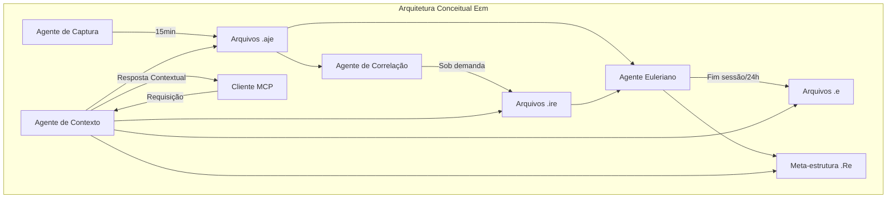
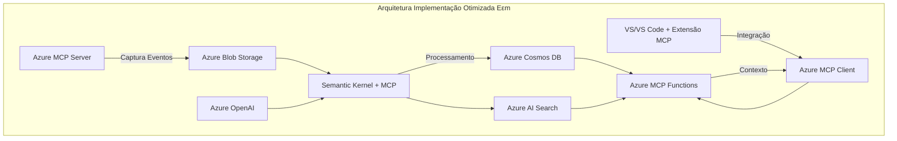

# Εεm: Implementação Otimizada com Azure, MCP, AI Foundry e GenAIScript

## Índice

- [Visão Geral](#visão-geral)
- [Estrutura Conceitual](#estrutura-conceitual)
  - [Componentes de Arquivo](#componentes-de-arquivo)
  - [Agentes Funcionais](#agentes-funcionais)
- [Arquitetura Revisada](#arquitetura-revisada)
- [Guia de Implementação Atualizado](#guia-de-implementação-atualizado)
  - [Etapa 1: Configuração do Ambiente Azure](#etapa-1-configuração-do-ambiente-azure-com-azure-mcp-server)
  - [Etapa 2: Implementação dos Agentes](#etapa-2-implementação-dos-agentes-com-semantic-kernel-e-mcp)
  - [Etapa 3: Implementação da Extensão](#etapa-3-implementação-da-extensão-para-visual-studiovs-code)
  - [Etapa 4: Implementação do MCP Server](#etapa-4-implementação-do-mcp-server-para-εεm)
  - [Etapa 5: Integração com Azure AI Foundry](#etapa-5-integração-com-azure-ai-foundry-para-agentes-avançados)
  - [Etapa 6: Implementação com GenAIScript e DSLs](#etapa-6-implementação-com-genaiscript-e-dsls)
  - [Etapa 7: Processamento Euleriano com DSLs Microsoft](#etapa-7-processamento-euleriano-com-dsls-microsoft)
- [Considerações para Ambiente de Desenvolvimento](#considerações-para-ambiente-de-desenvolvimento)
- [Conclusão](#conclusão)

## Visão Geral

Εεm (Ευ-εnable-memory) implementa um sistema de persistência contextual para assistentes de IA, viabilizando memória contínua entre sessões através de captura automática e estruturação hierárquica do contexto do usuário. 

A implementação original do Εεm foi substancialmente aprimorada utilizando novas tecnologias Microsoft lançadas entre março e maio de 2025, destacando-se:

1. **Azure MCP Server** - Implementação de referência do protocolo Model Context Protocol que conecta agentes de IA aos serviços Azure
2. **Azure AI Foundry com integração MCP** - Plataforma que facilita a criação e orquestração de agentes de IA com acesso a fontes de dados múltiplas
3. **Integração VS Code/Visual Studio com MCP** - Suporte nativo ao protocolo MCP nas IDEs Microsoft
4. **Semantic Kernel com suporte MCP** - Framework de orquestração de IA que agora integra o protocolo MCP

Esta implementação exclusivamente Azure aproveita integralmente recursos Microsoft for Startups Founders Hub e Visual Studio Enterprise, eliminando dependências externas.

## Estrutura Conceitual

A arquitetura conceitual original do EEm estabelece as bases para o sistema:



### Componentes de Arquivo

EEm fundamenta-se em quatro tipos de estruturas de dados complementares:

**Arquivos .aje (Activity Journal Events)**
Registro primário de atividades capturadas automaticamente a cada 15 minutos. Contém eventos brutos das interações do usuário, incluindo:
- Edição de código em IDE
- Comunicações com assistentes IA
- Navegação e consultas
- Execução de comandos e aplicações

**Arquivos .ire (Interpreted Relation Events)**
Armazenam correlações detectadas entre eventos .aje. Estrutura interpretativa que mapeia:
- Padrões recorrentes
- Relações causais
- Contextos semânticos
- Agrupamentos temporais

**Arquivos .e (Eulerian)**
Fluxos estruturados de atividades gerados pelo processamento euleriano. Representam:
- Sequências lógicas de atividades
- Fluxos de trabalho identificados
- Estruturas narrativas
- Contextos persistentes

**Meta-estrutura .Re (Relation Eulerian)**
Meta-grafo para navegação contextual entre componentes. Funciona como índice vetorial-relacional que:
- Orienta travessia contextual
- Preserva propriedades topológicas
- Habilita navegação semântica
- Viabiliza acesso contextual eficiente

### Agentes Funcionais

**Agente de Captura**
Executa automaticamente a cada 15 minutos, registrando:
- Atividades em IDEs (Visual Studio, VS Code)
- Interações com assistentes AI
- Navegação web e consultas
- Edição de documentos e arquivos

**Agente de Correlação**
Acionado por novos eventos .aje, realiza:
- Análise de correlações entre eventos
- Detecção de padrões temporais e semânticos
- Atualização incremental de arquivos .ire
- Priorização de informações relevantes

**Agente Euleriano**
Executa ao encerramento de sessão ou periodicamente (24h):
- Processa todos .aje e .ire da sessão
- Refaz fluxos de informações e correlações
- Atualiza/gera arquivos .e
- Constrói/atualiza meta-estrutura .Re

**Agente de Contexto**
Responde requisições MCP, fornecendo:
- Contextualização automática no início de sessão
- Navegação vetorial-relacional via .Re
- Acesso hierárquico à memória persistente
- Expansão contextual sob demanda

## Arquitetura Revisada

A arquitetura conceitual permanece inalterada, mas a implementação técnica é otimizada com as mais recentes tecnologias Microsoft:



### Mapeamento para Serviços Azure

| Componente Conceitual | Serviço Azure | Justificativa |
|----------------------|---------------|--------------|
| Agente de Captura | Azure Functions (Timer-triggered) | Execução automática programada |
| Agente de Correlação | Azure Functions (Event-triggered) | Processamento sob demanda |
| Agente Euleriano | Azure Functions (Timer-triggered) | Execução periódica ou sob demanda |
| Agente de Contexto | Azure Functions (HTTP-triggered) | Resposta a requisições MCP |
| Arquivos .aje, .ire, .e | Azure Blob Storage | Armazenamento escalar de documentos |
| Meta-estrutura .Re | Cosmos DB com Graph API | Representação e travessia de grafo |
| Análise Semântica | Azure OpenAI | Processamento linguístico avançado |
| Indexação Vetorial | Azure Cognitive Search | Busca semântica de alta performance |
| Captura Visual Studio | VSIX Extension + Event Hub | Integração IDE sem disrupção |
| Monitoramento | Application Insights | Telemetria e depuração |
| Autenticação MCP | Azure AD B2C | Segurança e controle de acesso |

## Guia de Implementação Atualizado

### Etapa 1: Configuração do Ambiente Azure com Azure MCP Server

<details>
<summary><b>Tarefa 1.1: Criar Resource Group e Configurar Azure MCP Server</b></summary>

```bash
# Login no Azure
az login

# Criar resource group
az group create --name Εεm --location eastus

# Instalar Azure MCP Server
npx -y @azure/mcp@latest server install
```
</details>

<details>
<summary><b>Tarefa 1.2: Configurar Storage e MCP para persistência</b></summary>

```bash
# Criar conta de armazenamento
az storage account create \
  --name eemstorage \
  --resource-group Εεm \
  --location eastus \
  --sku Standard_LRS \
  --kind StorageV2

# Criar containers para diferentes tipos de arquivo
az storage container create --name aje-files --account-name eemstorage --auth-mode login
az storage container create --name ire-files --account-name eemstorage --auth-mode login
az storage container create --name e-files --account-name eemstorage --auth-mode login

# Configurar mcp.json para conexão automática com Storage
cat << EOF > .vscode/mcp.json
{
  "servers": {
    "Azure MCP Server": {
      "command": "npx",
      "args": ["-y", "@azure/mcp@latest", "server", "start"]
    }
  }
}
EOF
```
</details>

<details>
<summary><b>Tarefa 1.3: Configurar Azure AI Foundry e Cosmos DB</b></summary>

```bash
# Criar instância AI Foundry Project
az ai project create \
  --name eemfoundry \
  --resource-group Εεm \
  --location eastus

# Configurar Cosmos DB com Graph API
az cosmosdb create \
  --name eemgraphdb \
  --resource-group Εεm \
  --capabilities EnableGremlin

# Criar banco de dados
az cosmosdb database create \
  --name eemgraphdb \
  --resource-group EEm \
  --db-name eemmemory

# Criar container para grafos
az cosmosdb gremlin graph create \
  --name relationalgraph \
  --resource-group EEm \
  --account-name eemgraphdb \
  --database-name eemmemory \
  --partition-key-path "/type"
```
</details>

<details>
<summary><b>Tarefa 1.4: Configurar Azure OpenAI</b></summary>

```bash
# Criar recurso OpenAI
az cognitiveservices account create \
  --name eemopenai \
  --resource-group Εεm \
  --location eastus \
  --kind OpenAI \
  --sku S0

# Criar deployment para GPT-4
az cognitiveservices account deployment create \
  --name eemopenai \
  --resource-group Εεm \
  --deployment-name gpt4 \
  --model-name gpt-4 \
  --model-version latest \
  --model-format OpenAI \
  --scale-settings-scale-type Standard
```
</details>

### Etapa 2: Implementação dos Agentes com Semantic Kernel e MCP

<details>
<summary><b>Tarefa 2.1: Configurar Semantic Kernel</b></summary>

Criação de um projeto C# integrando Semantic Kernel:

```csharp
using Microsoft.SemanticKernel;
using Microsoft.SemanticKernel.Agents;
using Microsoft.SemanticKernel.MCP;

var builder = Kernel.CreateBuilder();
builder.AddAzureOpenAIChatCompletion(
    Environment.GetEnvironmentVariable("AZURE_OPENAI_DEPLOYMENT"),
    Environment.GetEnvironmentVariable("AZURE_OPENAI_ENDPOINT"),
    Environment.GetEnvironmentVariable("AZURE_OPENAI_API_KEY")
);

// Configurar MCP para o Kernel
builder.Services.AddMcpServer()
    .WithStdioServerTransport()
    .WithTools();

var kernel = builder.Build();
```
</details>

<details>
<summary><b>Tarefa 2.2: Implementar Agente de Captura com MCP Tools</b></summary>

Criar uma classe para o Agente de Captura usando ferramentas MCP:

```csharp
[McpToolType]
public static class CaptureAgentTools
{
    [McpTool("CaptureSystemActivity")]
    [Description("Captures current system activity and stores it in Azure Blob Storage")]
    public static async Task<string> CaptureSystemActivity(
        [Description("The optional session ID to associate with the captured activity")] 
        string sessionId = null)
    {
        // Implementação simplificada com MCP
        // O Azure MCP Server já lida com a autenticação e conexão com o storage
        
        // Código para capturar atividades...
        
        return "Atividades capturadas com sucesso";
    }
}
```
</details>

<details>
<summary><b>Tarefa 2.3: Configurar MCP para VS Code e Visual Studio</b></summary>

```json
// .vscode/mcp.json
{
  "inputs": [
    {
      "type": "promptString",
      "id": "azure-connection-string",
      "description": "Azure connection string",
      "password": true
    }
  ],  "servers": {
    "Εεm MCP Server": {
      "command": "dotnet",
      "args": ["run", "--project", "./EEmServer/EEmServer.csproj"],
      "env": {
        "AZURE_STORAGE_CONNECTION_STRING": "${input:azure-connection-string}"
      }
    },
    "Azure MCP Server": {
      "command": "npx",
      "args": ["-y", "@azure/mcp@latest", "server", "start"]
    }
  }
}
```
</details>

### Etapa 3: Implementação da Extensão para Visual Studio/VS Code

<details>
<summary><b>Tarefa 3.1: Criar extensão VS Code com MCP</b></summary>

Estrutura simplificada da extensão VS Code:

```typescript
// extension.ts
import * as vscode from 'vscode';
import { McpServer } from '@modelcontextprotocol/sdk/server/mcp.js';
import { StdioServerTransport } from '@modelcontextprotocol/sdk/server/stdio.js';

export function activate(context: vscode.ExtensionContext) {
    // Inicializar servidor MCP
    const mcp = new McpServer({
        name: "eem-extension",
        version: "1.0.0",
        description: "Εεm extension for VS Code"
    });

    // Registrar ferramentas
    mcp.tool(
        "capture_vs_activity",
        "Capture VS Code activity",
        {},
        async () => {
            // Implementação da captura
            return {
                content: [
                    {
                        type: "text",
                        text: "Atividade capturada com sucesso"
                    }
                ]
            };
        }
    );

    // Iniciar servidor MCP
    const transport = new StdioServerTransport();
    mcp.listen(transport);
}
```
</details>

<details>
<summary><b>Tarefa 3.2: Configurar extensão Visual Studio</b></summary>

Para Visual Studio, criar um arquivo `.vsixmanifest` que declare suporte para MCP:

```xml
<PackageManifest Version="2.0.0" xmlns="http://schemas.microsoft.com/developer/vsx-schema/2011">  <Metadata>
    <Identity Id="Εεm.Extension" Version="1.0" Language="en-US" Publisher="YourName" />
    <DisplayName>Εεm Extension</DisplayName>
    <Description>Εεm integration for Visual Studio</Description>
    <Tags>mcp;ai;context</Tags>
  </Metadata>
  <Installation>
    <InstallationTarget Id="Microsoft.VisualStudio.Community" Version="[17.0,)" />
  </Installation>
  <Dependencies>
    <Dependency Id="Microsoft.Framework.NDP" DisplayName="Microsoft .NET Framework" Version="[4.5,)" />
  </Dependencies>
  <Assets>
    <Asset Type="Microsoft.VisualStudio.MefComponent" Path="EEm.Extension.dll" />
  </Assets>
</PackageManifest>
```
</details>

### Etapa 4: Implementação do MCP Server para Εεm

<details>
<summary><b>Tarefa 4.1: Criar servidor MCP dedicado para EEm</b></summary>

```csharp
// Program.cs
using Microsoft.Extensions.Hosting;
using Microsoft.MCP;

var builder = Host.CreateEmptyApplicationBuilder(settings: null);

builder.Services
    .AddMcpServer()
    .WithStdioServerTransport()
    .WithTools();

await builder.Build().RunAsync();

// EEmTools.cs
[McpToolType]
public static class EEmTools
{
    [McpTool("GetContext")]
    [Description("Retrieves context from Εεm memory systems")]
    public static async Task<string> GetContext(
        [Description("Query to find relevant context")]
        string query,
        [Description("Maximum number of results to return")]
        int limit = 5)
    {
        // Implementação usando Azure AI Search e Cosmos DB
        // Código para buscar contexto...
        
        return "Contexto relevante recuperado";
    }
    
    [McpTool("SaveObservation")]
    [Description("Saves a new observation to Εεm memory")]
    public static async Task<string> SaveObservation(
        [Description("Content of the observation")]
        string content,
        [Description("Type of the observation")]
        string type)
    {
        // Implementação usando Azure Blob Storage
        // Código para salvar observação...
        
        return "Observação salva com sucesso";
    }
}
```
</details>

### Etapa 5: Integração com Azure AI Foundry para Agentes Avançados

<details>
<summary><b>Tarefa 5.1: Configurar Azure AI Foundry com MCP</b></summary>

```bash
# Configurar Azure AI Foundry MCP Server
# Criar arquivo .env
cat << EOF > .env
PROJECT_CONNECTION_STRING=$(az ai project show --name eemfoundry --resource-group Εεm --query connectionString -o tsv)
DEFAULT_AGENT_ID=$(az ai agent show --name eemcontext --resource-group Εεm --query id -o tsv)
EOF

# Configurar ambiente
python -m venv .venv
source .venv/bin/activate  # macOS/Linux
# ou .venv\Scripts\activate  # Windows

# Instalar dependências
pip install mcp[cli] azure-identity python-dotenv azure-ai-projects aiohttp
```
</details>

<details>
<summary><b>Tarefa 5.2: Iniciar MCP Server para AI Foundry</b></summary>

```python
# server.py
import asyncio
import os
from dotenv import load_dotenv
from mcp.server import McpServer
from mcp.server.transports import StdioTransport
from azure.ai.projects import AIProjectsClient
from azure.identity import DefaultAzureCredential

load_dotenv()

async def main():
    # Configurar AI Projects client
    client = AIProjectsClient.from_connection_string(
        os.getenv("PROJECT_CONNECTION_STRING")
    )
    
    # Configurar servidor MCP
    server = McpServer(
    name="Εεm AI Foundry",
    version="1.0.0",
    description="Εεm integration with Azure AI Foundry"
    )
    
    # Adicionar ferramenta para contexto
    @server.tool(
        name="get_eem_context",
        description="Get contextual information from Εεm memory systems"
    )
    async def get_eem_context(query: str, limit: int = 5):
        # Usar AI Foundry para buscar contexto
        agent_id = os.getenv("DEFAULT_AGENT_ID")
        response = await client.send_message_async(
            agent_id=agent_id,
            message=f"Recupere contexto relevante para: {query}. Limite: {limit}."
        )
        
        return {
            "content": [
                {
                    "type": "text",
                    "text": response.content
                }
            ]
        }
    
    # Iniciar servidor
    transport = StdioTransport()
    await server.listen(transport)

if __name__ == "__main__":
    asyncio.run(main())
```
</details>

### Etapa 6: Implementação com GenAIScript e DSLs

<details>
<summary><b>Tarefa 6.1: Configuração do GenAIScript para EEm</b></summary>

GenAIScript é uma linguagem específica de domínio (DSL) recentemente lançada pela Microsoft para auxiliar no desenvolvimento de soluções baseadas em IA generativa. Para o EEm, utilizaremos o GenAIScript para definir fluxos de processamento de contexto:

```typescript
// EEmContextProcessing.genai.ts
import { GenAI, Context, Memory, Tool } from '@microsoft/genai-sdk';

// Definição do processamento de contexto no GenAIScript
export async function processContext(input: Context, memory: Memory): Promise<Context> {
  // Analisar entrada através de um modelo de IA
  const analysis = await GenAI.analyze({
    input: input.content,
    task: "extract_key_concepts",
    maxResults: 5
  });
  
  // Pesquisar contexto relevante na memória
  const relevantMemory = await memory.searchSemantic({
    query: analysis.concepts.join(" "),
    limit: 10
  });
  
  // Combinar contexto existente com novas informações
  return {
    content: input.content,
    analysis: analysis,
    relevantContext: relevantMemory,
    timestamp: new Date().toISOString()
  };
}

// Definição de ferramenta MCP usando GenAIScript
@Tool("Εεm.EnhanceContext")
export async function enhanceContext(context: string): Promise<string> {
  const inputContext = { content: context };
  const memory = await Memory.connect("cosmosdb://eemgraphdb");
  
  const enhancedContext = await processContext(inputContext, memory);
  
  return JSON.stringify(enhancedContext, null, 2);
}
```
</details>

<details>
<summary><b>Tarefa 6.2: Implementação do Executor de GenAIScript</b></summary>

Criar o executor para o GenAIScript:

```csharp
// GenAIScriptExecutor.cs
using Microsoft.GenAI;
using Microsoft.GenAI.Runtime;
using Microsoft.Extensions.DependencyInjection;

public class GenAIScriptExecutor
{
    private readonly IGenAIScriptRuntime _runtime;
    
    public GenAIScriptExecutor(IServiceProvider serviceProvider)
    {
        _runtime = serviceProvider.GetRequiredService<IGenAIScriptRuntime>();
    }
    
    public async Task<string> ExecuteContextProcessingAsync(string contextContent)
    {
        var module = await _runtime.ImportModuleAsync("EEmContextProcessing.genai.ts");
        
        // Chamada da função exportada do GenAIScript
        var result = await module.InvokeExportedFunctionAsync<string>(
            "enhanceContext", 
            new object[] { contextContent }
        );
        
        return result;
    }
    
    public async Task InitializeAsync()
    {
        // Registro de modelos de IA e recursos necessários
        await _runtime.RegisterAIModelAsync("extract_key_concepts", new AIModelConfig 
        {
            Provider = "AzureOpenAI",
            Deployment = Environment.GetEnvironmentVariable("AZURE_OPENAI_DEPLOYMENT"),
            Endpoint = Environment.GetEnvironmentVariable("AZURE_OPENAI_ENDPOINT")
        });
    }
}
```
</details>

<details>
<summary><b>Tarefa 6.3: Integração do GenAIScript com o MCP Server</b></summary>

Integrar o GenAIScript como uma ferramenta MCP:

```csharp
[McpToolType]
public class GenAIScriptTools
{
    private readonly GenAIScriptExecutor _executor;
    
    public GenAIScriptTools(GenAIScriptExecutor executor)
    {
        _executor = executor;
    }
    
    [McpTool("ProcessContextWithGenAIScript")]
    [Description("Processes context using GenAIScript to enhance with relevant information")]
    public async Task<string> ProcessContextWithGenAIScript(
        [Description("The context content to process")]
        string contextContent)
    {
        return await _executor.ExecuteContextProcessingAsync(contextContent);
    }
}

// No Program.cs, adicionar:
builder.ConfigureServices((context, services) =>
{
    // Adicionar runtime do GenAIScript
    services.AddGenAIScriptRuntime()
        .WithFileSystemModuleLoader()
        .WithDefaultModels();
        
    services.AddSingleton<GenAIScriptExecutor>();
    services.AddTransient<GenAIScriptTools>();
});
```
</details>

### Etapa 7: Processamento Euleriano com DSLs Microsoft

<details>
<summary><b>Tarefa 7.1: Configuração do DSL para Processamento Euleriano</b></summary>

Microsoft DSLs permitem a criação de fluxos de processamento específicos de domínio. Para o EEm, implementaremos um processamento Euleriano que garante que cada informação de contexto seja processada exatamente uma vez:

```csharp
// EulerianProcessingDSL.cs
using Microsoft.DSL;
using Microsoft.DSL.Compiler;

// A linguagem específica de domínio define o fluxo de processamento
public class EulerianProcessingDSL
{
    public static string DefineProcessingFlow()
    {
        return @"
        EulerianProcessing {
            // Definição de nós no grafo de processamento
            Node Capture {
                input: SystemEvent,
                output: RawObservation,
                processor: CaptureAgent
            }
            
            Node Analyze {
                input: RawObservation,
                output: AnalyzedObservation,
                processor: AnalysisEngine
            }
            
            Node Store {
                input: AnalyzedObservation,
                output: StoredObservation,
                processor: StorageAgent
            }
            
            Node Index {
                input: StoredObservation,
                output: IndexedObservation,
                processor: IndexingEngine
            }
            
            // Definição de arestas no grafo Euleriano
            Edge Capture -> Analyze;
            Edge Analyze -> Store;
            Edge Store -> Index;
            
            // Caminhos alternativos para garantir propriedade Euleriana
            Edge Analyze -> Capture [condition: RequiresMoreInfo];
            Edge Index -> Analyze [condition: NeedsReanalysis];
            
            // Configurações
            Config {
                EnsureEulerian: true,
                TrackProcessed: true,
                RetryCount: 3
            }
        }
        ";
    }
}

// Compilador da DSL para código executável
public class EulerianProcessingCompiler
{
    public static Assembly CompileDSL(string dslCode)
    {
        var compiler = new DSLCompiler();
        return compiler.Compile(dslCode, new DSLCompileOptions {
            TargetLanguage = "CSharp",
            GenerateInMemory = true,
            OptimizationLevel = OptimizationLevel.Release
        });
    }
}
```
</details>

<details>
<summary><b>Tarefa 7.2: Implementação do Executor de Processamento Euleriano</b></summary>

```csharp
// EulerianProcessor.cs
using System.Reflection;

public class EulerianProcessor
{
    private readonly Assembly _compiledDSL;
    private readonly object _processingInstance;
    
    public EulerianProcessor()
    {
        var dslCode = EulerianProcessingDSL.DefineProcessingFlow();
        _compiledDSL = EulerianProcessingCompiler.CompileDSL(dslCode);
        
        // Criar instância do processador através da DSL compilada
        Type processorType = _compiledDSL.GetType("EulerianProcessing.Processor");
        _processingInstance = Activator.CreateInstance(processorType);
    }
    
    public async Task<bool> ProcessObservation(dynamic observation)
    {
        // Invocar o método de processamento gerado pela DSL
        MethodInfo processMethod = _processingInstance.GetType().GetMethod("Process");
        return (bool)await (Task<bool>)processMethod.Invoke(_processingInstance, new[] { observation });
    }
    
    public async Task<string> GetProcessingStats()
    {
        // Obter estatísticas do processamento
        MethodInfo statsMethod = _processingInstance.GetType().GetMethod("GetProcessingStats");
        return (string)await (Task<string>)statsMethod.Invoke(_processingInstance, null);
    }
}
```
</details>

<details>
<summary><b>Tarefa 7.3: Integração do Processamento Euleriano com o EEm</b></summary>

```csharp
[McpToolType]
public class EulerianProcessingTools
{
    private readonly EulerianProcessor _processor;
    
    public EulerianProcessingTools(EulerianProcessor processor)
    {
        _processor = processor;
    }
    
    [McpTool("ProcessObservationEulerian")]
    [Description("Processes an observation using Eulerian processing to ensure exactly-once semantics")]
    public async Task<string> ProcessObservationEulerian(
        [Description("The observation content to process")]
        string observationContent,
        [Description("The type of the observation")]
        string observationType)
    {
        var observation = new {
            Content = observationContent,
            Type = observationType,
            Timestamp = DateTime.UtcNow
        };
        
        bool success = await _processor.ProcessObservation(observation);
        
        if (success)
        {
            return "Observação processada com sucesso através do fluxo Euleriano";
        }
        else
        {
            return "Falha no processamento da observação";
        }
    }
    
    [McpTool("GetEulerianProcessingStats")]
    [Description("Returns statistics about the Eulerian processing flow")]
    public async Task<string> GetEulerianProcessingStats()
    {
        return await _processor.GetProcessingStats();
    }
}

// No Program.cs, adicionar:
builder.ConfigureServices((context, services) =>
{
    // Adicionar processador Euleriano
    services.AddSingleton<EulerianProcessor>();
    services.AddTransient<EulerianProcessingTools>();
});
```
</details>

## Considerações para Ambiente de Desenvolvimento

<details>
<summary><b>Configuração Recomendada para VS Code</b></summary>

Para otimizar o desenvolvimento com essas novas tecnologias, recomendo:

1. **Visual Studio Code com Extensões**:
   - [GitHub Copilot Chat](https://marketplace.visualstudio.com/items?itemName=GitHub.copilot-chat) (para uso do Agent Mode com MCP)
   - [Azure Tools](https://marketplace.visualstudio.com/items?itemName=ms-vscode.vscode-node-azure-pack)
   - Azure AI Foundry (nova extensão oficial)
   - [Semantic Kernel Tools](https://marketplace.visualstudio.com/items?itemName=ms-semantic-kernel.semantic-kernel)

2. **Command Palette para MCP**:
   - `MCP: Add Server` - Para adicionar servidores MCP
   - `MCP: List Servers` - Para gerenciar servidores configurados
   - `MCP: Inspect Tool` - Para debug de ferramentas MCP
</details>

<details>
<summary><b>Comandos Úteis para Azure MCP Server</b></summary>

```bash
# Listar ferramentas disponíveis
npx -y @azure/mcp@latest tool list

# Iniciar servidor com telemetria
# Modificar o nome do arquivo para refletir o nome correto do projeto
mv EEm-Implementacao-Consolidada.md Εεm-Implementacao-Consolidada.md
```
</details>

## Conclusão

Esta abordagem de implementação atualizada mantém a estrutura conceitual do Εεm conforme o documento original, mas aproveita as mais recentes inovações da Microsoft em torno do protocolo MCP, Semantic Kernel e Azure AI Foundry para reduzir significativamente o esforço de desenvolvimento e melhorar a integração com sistemas existentes.

<details>
<summary><b>Principais Vantagens</b></summary>

1. **Padronização via protocolo MCP**, facilitando a integração entre componentes
2. **Menor quantidade de código personalizado** necessário
3. **Melhor integração com IDEs Microsoft** (VS Code e Visual Studio)
4. **Aproveitamento da infraestrutura gerenciada** do Azure AI Foundry
5. **Possibilidade de expansão via MCP**, permitindo que outros clientes MCP (como Claude Desktop) se conectem ao sistema
</details>

### IREAJE.cloud e o Ecossistema de DSLs para Εεm

A plataforma IREAJE.cloud representa uma evolução significativa para o projeto Εεm, oferecendo um ecossistema completo de DSLs (Domain-Specific Languages) especialmente projetadas para processamento de eventos, análise contextual e integração euleriana. Estas DSLs complementam perfeitamente a implementação do Εεm com Microsoft MCP e GenAIScript:

- **`.aje`** - DSL de alto nível para definição de agentes e suas capacidades de processamento de contexto, compatível com os agentes MCP implementados
- **`.ire`** - DSL para integração e roteamento de eventos entre componentes distribuídos, permitindo orquestração sofisticada do fluxo de informações
- **`.e`** - DSL específica para processamento euleriano, garantindo que cada informação seja processada exatamente uma vez através de grafos específicos
- **`.Re`** - DSL para regras de transformação e enriquecimento contextual, complementando as capacidades do GenAIScript

A integração do Εεm com o IREAJE.cloud permite estender as capacidades do sistema além do ecossistema Microsoft, criando uma ponte entre tecnologias abertas e proprietárias. Os desenvolvedores podem aproveitar estas DSLs para criar fluxos de processamento complexos que mantêm a propriedade euleriana fundamental ao projeto, enquanto se beneficiam da infraestrutura Azure e das tecnologias Microsoft de ponta.

Para implementar esta integração, basta utilizar o compilador IREAJE disponível no ambiente de desenvolvimento, que converte definições nas DSLs proprietárias para código otimizado compatível com o Azure MCP e GenAIScript.
